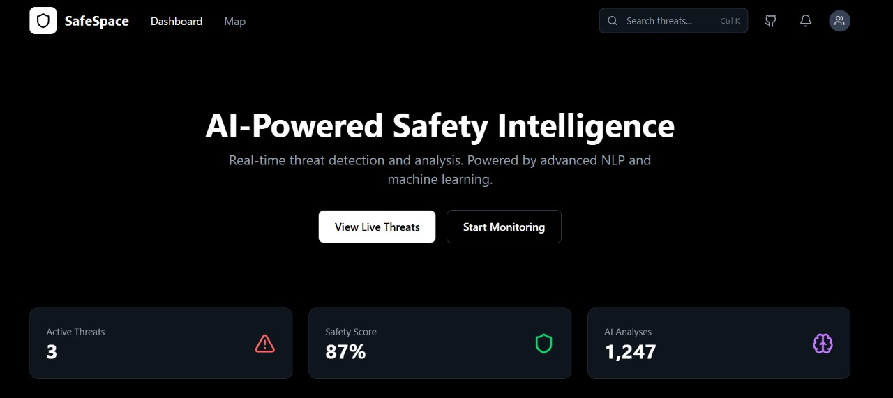
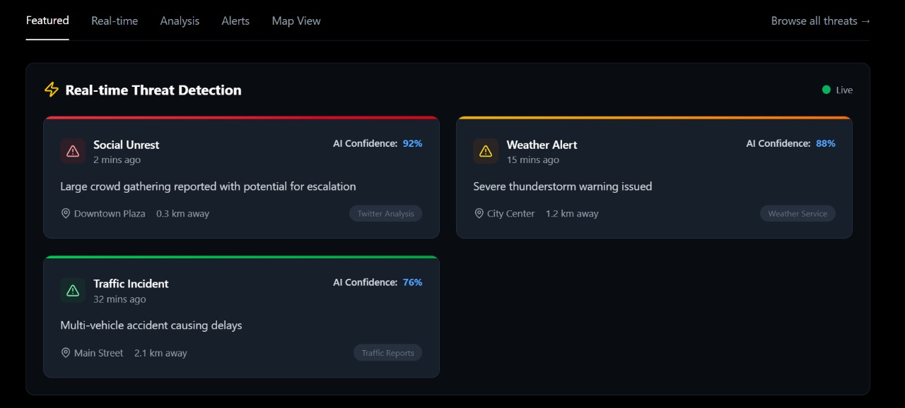

# 🛡️ SafeSpace – AI Monitored Safety App

> Real-time safety alerts powered by AI, location data, and threat intelligence from the internet.

---

## 📌 Table of Contents

- [What is SafeSpace?](#what-is-safespace)
- [Problem It Solves](#problem-it-solves)
- [How It Works](#how-it-works)
- [Key Features](#key-features)
- [Upcoming Features](#upcoming-features)
- [Tech Stack](#tech-stack)
- [Impact](#impact)
- [Uniqueness](#uniqueness)
- [Getting Started](#getting-started)
- [Contributions](#contributions)

---

## ❓ What is SafeSpace?

**SafeSpace** is an AI-powered safety monitoring application that provides users with real-time alerts about potential threats in their vicinity. It combines geolocation, live news feeds, and social media intelligence using natural language processing to detect incidents like violence, protests, riots, disasters, or other threats – helping users make safer decisions, faster.

---

## 🚨 Problem It Solves

- People often walk into dangerous zones unknowingly due to lack of real-time information.
- Existing safety apps rely on user-reported events, which leads to delayed alerts.
- Lack of integration between location, AI, and internet-based threat signals.

---

## 💡 How It Works

1. **Fetch Real-Time Data** from news APIs, social feeds (optional), and internal reports.
2. **Process Text with NLP Models** to detect risky events or threatening keywords.
3. **Compare with User’s Location** using browser-based geolocation API.
4. **Send Smart Alerts** with confidence scores and suggested actions.

---

## 🌟 Key Features

- 📍 Auto-detects user location in real-time
- 🧠 AI-based threat analysis from news and online content
- 🔔 Instant alerts when threat is nearby
- 🌐 Interactive map view with danger zones
- 📊 Threat dashboard and history log
- 📱 Fully responsive & animated UI using Tailwind + Framer Motion

---

## 🧩 Upcoming Features

- 🚷 Danger zone heatmaps powered by AI clustering
- 📡 Push notifications (PWA or Firebase)
- 🧑‍🤝‍🧑 User community alert system (peer reports)
- 🗣️ Voice command integration
- 🔒 Safety score for locations
- 🧪 Fake alert testing tool for judges/demo

---

## 🛠️ Tech Stack

| Layer       | Tech Used |
|-------------|-----------|
| Frontend    | React, TailwindCSS, Framer Motion |
| Backend     | Node.js, Express, Firebase or MongoDB |
| AI/NLP      | Python, Transformers (RoBERTa/BART), spaCy, scikit-learn |
| APIs        | NewsAPI, Geolocation API |
| Dev Tools   | Git, Postman, Vite, VS Code |

---

## 🌍 Impact

- Helps reduce crimes, accidents, and panic in public spaces
- Adds an AI-powered safety layer to urban and rural life
- Supports real-time awareness in disaster-prone zones
- Encourages a safer, smarter society using emerging tech

---

## 🧠 Uniqueness

- Unlike generic safety apps, this one **analyzes external data sources using real NLP models**.
- Focuses on **real-time passive alerts**, not just crowd-sourced reports.
- Provides **confidence-based risk scores** instead of simple binaries (safe/unsafe).
- Built with **elite UI + intelligent backend**, making it ready for real-world impact.

---

## Screenshots

## 🤝 Contributions

We welcome contributions of all types!

- 🧠 AI/NLP model improvements
- 💻 UI/UX enhancements
- ⚙️ API integrations
- 🧪 Test cases and bug fixes
- 📄 Documentation updates

Feel free to fork, submit PRs, or open issues. Let’s make the world safer – together.
